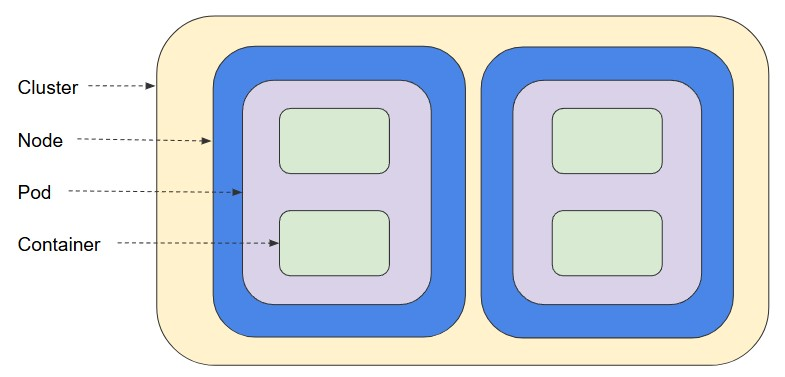
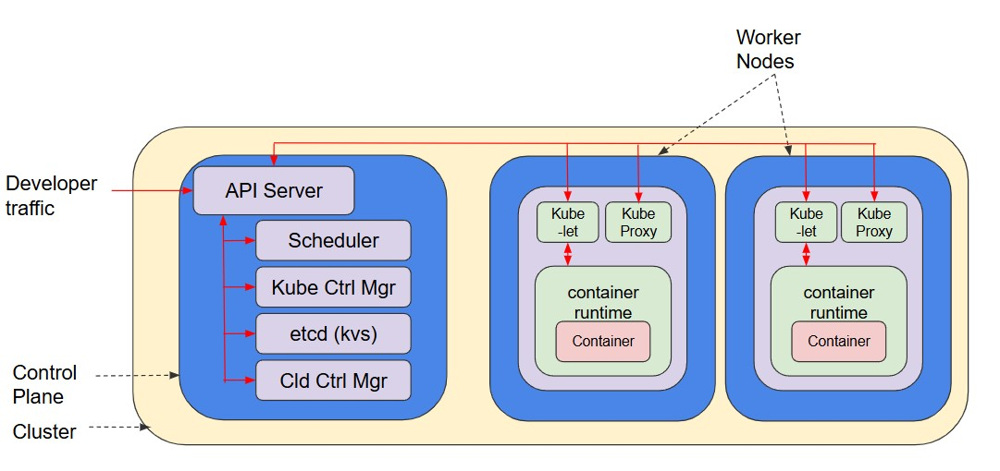
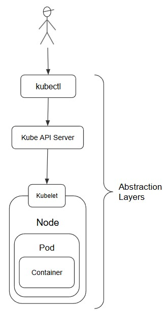
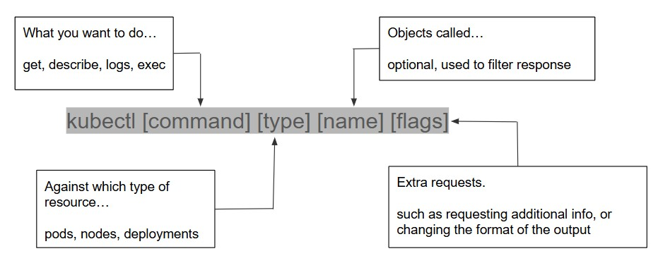

# Introduction to Kubernetes
Kubernetes, often abbreviated to K8S (K & S, with 8 characters in between), is a container orchestration platform. 

If you create a container using Docker (the most popular tool for creating and running containers) you’re presented with the running container, which is hopefully running your app. But you can also interact directly with the container by accessing it's Shell, then issue commands as you would with a normal Linux computer.

With Kubernetes we don’t interact directly with containers often, particularly since we may have thousands of them, so they’re abstracted away by logical layers and objects that we do interact with.

## Nodes and Pods
K8S has lots of objects that you need to be aware of, the first two are: 

### Nodes
These are the servers or VMs, on which your pods run. Most deployments will have at least two nodes, one hosting your Pods, and one for your `Control Plane`.

### Pods
The building blocks and smallest deployable object in k8s:
- K8S creates a virtual network, and pods are given an IP on that network.
- Pods are ephemeral (temporary) and receive a new IP upon re-creation

Every running container is in a pod, it’s the environment for one or more containers, but when there is more than one they’re tightly coupled & share resources.



Each pod is assigned a unique IP, and the containers within share the network namespace, IP, & ports, and the pod can also specify shared storage volumes. 
Containers within a pod may communicate via loopback.

## Kubernetes Concepts
There are two things two first appreciate about how Kubernetes (k8s) works; Firstly it uses an **object model**, i.e. everything is represented by objects. We don’t manage the item itself, we manage the object that represents that item.

The next point is that k8s uses **declarative management** which simply means that you don’t make statements about *what you want to do*, instead you declare *how things should be*.

Consider the difference between 

>deploy a web server and a database

vs.

>there should be a web server and a database.

If you run the first statement multiple times you may end up with multiple servers and DB’s, whereas the second one will verify the existing items before taking action.

With kubernetes (and many other technologies) you declare your desired state, how things should be, and the actual steps to make that happen are abstracted away from you, and automated as much as possible.

## Kubernetes Objects
Each item K8S manages is represented by an object, there are many different types or ‘kinds’, but don’t worry about memorising them.


Objects have two important elements:
- **Spec** = the desired state of the object
- **Status** = the current state of the object

In brief, Kubernetes’ job is to make these match.

Objects can describe:
- What containerised applications are running (and on which nodes)
- The resources available to those applications
- The policies around how those applications behave, such as restart policies, upgrades, and fault-tolerance

To work with Kubernetes objects—whether to create, modify, or delete them—you'll need to use the Kubernetes API via the kubectl command-line interface

## Control Plane
The Control Plane is the collection of cooperating processes that make the cluster work, although typically you may only interact with a few of them. 

A cluster will typically run across multiple servers, with one being the control plane controlling and coordinating the cluster, and the others are nodes running pods.

>There is a version of K8S which creates a local node containing the control plane and pods all together in a VM called Minikube. Used primarily for learning and development, we’ve created a Linux VM with it installed for you.

Let’s consider some of these points in a scenario to give context.

You want 3x nginx web servers running, each in their own container:
1. You need to declare some object to represent the containers, i.e. some pods. - This declaration is simply a text file known as a manifest.
1. When your deployment is new, k8s will look at your desired state of 3 containers, and the running state of 0, and look to remedy the mismatch. Specifically, the control plane will launch 3x containers.
1. It will then continuously monitor the cluster to maintain the desired state.

### Components on the Control Plane
Several critical components run on the control plane

#### Kube API server
The only component you interact with directly; The API server accepts cmds to view or change the state of the cluster, such as launching new pods. The API server also authenticates and authorises incoming requests.

You interact with the server using `kubectl` commands which utilise the Kubernetes API.

Any query or change to the cluster is addressed to the Kube API server

- **Etcd** - The cluster’s DB, stores the state of the cluster and additional information such as member pods, pod locations (nodes), etc. *Only the API server interacts with Etcd.*

- **Kube Proxy** - maintains connectivity between pods in the cluster.

- **Kube Scheduler** - schedules pods onto the nodes by evaluating the requirements of each pod and selecting the most suitable node. Kube Scheduler doesn’t launch the pods, but once a node is selected it writes the node name to the relevant pod object.

    Kube Scheduler knows the state of all pods, and accounts for any constraints you define, e.g. specifying that certain pods require a node with a minimum h/w spec’ and other policies or restrictions. 

    You may also choose **affinity** or **anti-affinity** parameters, such as stating that specific pods may or may not run on the same node. 

- **Kube Controller Manager** - Continuously monitors the state of the cluster through the API server; When the current and desired states don’t match, KCM will attempt to make changes to remedy.

    Called the Kube Controller Manager, because many components are maintained by code loops we call 'controllers'. For example, the **Node Controller** monitors and responds to changes in node states.

    We could also create **controller objects** to represent and manage workloads, such as the three nginx containers from the earlier scenario.

- **Kube Cloud Manager** - like KCM, is used to manage controllers, but in this case it’s the controllers which interact with an underlying cloud provider. 

- **Kubelet** - A few Control Plane components run on each node, in a module called a Kubelet.

    When API Server needs to start a pod on a node it connects to the pod’s Kubelet.

    Kubelet uses the ‘container runtime’ on the node (similar to a VM’s hypervisor) to launch the pod, monitor it, probe it for readiness, and reports back to the Kube API Server.

### Container Runtimes
Container runtimes are software packages that enable you to launch containers on a host operating system; Containerd is the comtainer runtime which powers Docker and Kubernetes. Containerd is lightweight, reliable, and manages the entire container lifecycle from image transfer and storage to execution and supervision.

### Kubernetes Architecture
Here's a slightly more details architecture diagram showing how everything we've reviewed so far fits together.



- Notice all developer requests are directed to the Kube API Server
- When it receives a request the API Server decides which of the Control Plane' components need to be engaged to complete the job.
- The relevant component completes the request by communicating with the pod(s) via it's Kubelet.

### Object Management
To instruct K8S to create & maintain some objects you can write manifest files in either JSON or YAML*. These are simply text files defining the state of the object(s), it’s name, and usage. Required fields include:

- Kubernetes API version
- The Kind - the type of object e.g. a service, a deployment, etc.
- metadata including:
    - name & unique ID
    - namespace (optional)
    - spec - your desired state

The object’s name should be unique in the workspace, and it will receive a unique ID generated by K8S. 

Labels (KVPs) can be attached to objects to help identify and organise them. The `kubectl` command allows you to select and omit objects you wish to manage based on labels. 

*[Click here for a comparison of JSON and YAML](/json-vs-yaml.md)

- The object’s name should be unique in the workspace, and it will receive a unique ID generated by k8s. 
- Labels (KVPs) can be attached to objects to help identify and organise them. The kubectl command allows you to select and omit objects you wish to manage based on labels. 
- If you require several related objects for a deployment, best practice is to define them in the same manifest file for easier management.

It is likely that over time your deployments will evolve as you improve, refine, and optimise them. For this reason it is recommended that you store them in a version control repository (e.g. GitHub) for easy tracking and management, which also makes it easier to rollback changes when necessary, as well as recreating or restoring your clusters. 

### Deployment Controller
Deployments are good for long-running components, like web servers, and also facilitates managing them as a group. 

If we declare our 3x nginx pods as a Deployment YAML file, the **Deployment Controller Object** will monitor and maintain the required pods.

When Kube Scheduler schedules pods for deployment it notifies the Kube API server. The Deployment Controller creates a child-object called a **ReplicaSet** which launches the desired pods and maintains a stable set of replicas. 

If a pod fails the **ReplicaSet Controller** recognises the difference between the desired and current state, then launches new pods to rectify. 

### Deployments
Within a deployment object specify:
- The number of replica pods
- Which containers should run in the pods
- Which volumes should be mounted
- These templates are then used by controllers to maintain the desired state in the cluster. 

The below is an [example](https://kubernetes.io/docs/concepts/workloads/controllers/deployment/) of a Deployment which creates a ReplicaSet to bring up three nginx Pods:

```yaml
apiVersion: apps/v1
kind: Deployment
metadata:
  name: nginx-deployment
  labels:
    app: nginx
spec:
  replicas: 3
  selector:
    matchLabels:
      app: nginx
  template:
    metadata:
      labels:
        app: nginx
    spec:
      containers:
      - name: nginx
        image: nginx:1.14.2
        ports:
        - containerPort: 80
```

## Abstraction layers

Kubernetes has many different abstraction layers, designed to simplify management of complex environments, but they can get confusing themselves. Let’s try to lay them out…
1. We don’t interact with containers directly, that’s abstracted away by pods… but neither do we interact with pods directly, they’re abstracted away by nodes. 
1. We also don’t send commands to nodes, instead we communicate with Kubelet which manages the pods on each node, but we don’t communicate with kublet directly.
1. We want our apps to be highly available, so the objects are monitored by controllers. 
1. We don’t need to know commands for kubelet, controllers, and kube proxy. They’re all abstracted away through the Kubernetes API and we make calls to the Kube API server.
1. We don’t want to write complex API templates for the Kube API server every time, so that is abstracted away by another layer through the … wait for it … the `kubectl` command. 



## Kubectl
Kubectl is a command line utility (note: not a command line interface, but a utility accessed via a command line) used to communicate with the Kube API server on the control plane by transforming CLI commands into properly formatted API calls.

Administrators make requests to the cluster, and kubectl determines which part of the control plane to communicate with.

View a list of running pods in a cluster with `kubectl get pods`, when you do so:
1. Kubectl converts the cmd into an API call which is sent to the Kube API server on the cluster’s control plane using HTTPS. 
1. The API svr processes the request by querying etcd, then returns the result back to kubectl, again over HTTPS.
1. Kubectl interprets and displays the response to the user through the CLI.

Before use kubectl must be configured with the location and credentials of the K8S clusters it will be managing, these are stored in `.kube` in the user’s home directory.

For clusters created on one of the main public cloud providers, each provider offers a CLI command to retrieve these credentials. 
|Provider|Get Cluster Credentials command|
|---|---|
|AWS|`aws eks update-kubeconfig --name <cluster-name>`|
|GCP|`gcloud container clusters get-credentials <cluster-name>`|
|Azure|`az aks get-credentials --name <cluster-name> --resource-group <rg-name>`|

If you're manually creating/deploying a cluster you can use the equivalent Bash commands:

```sh
kubectl config set-credentials my-user --client-certificate=path/to/cert.crt --client-key=path/to/key.key
kubectl config set-cluster my-cluster --server=https://<api-server> --certificate-authority=path/to/ca.crt
kubectl config set-context my-context --cluster=my-cluster --user=my-user
kubectl config use-context my-context
```

Notice the extra complexity when deploying manually, compared to using a cloud provider's managed service. 

|Cloud Provider|Managed Kubernetes Service|
|---|---|
|Azure|Azure Kubernetes Service|
|AWS|Google Kubernetes Engine|
|GCP|Elastic Kubernetes Service|

The `.kube` file will be updated each time the command is run against a new cluster.

Once correctly configured kubectl references this file and connects to the default cluster without prompting for credentials each time.

#### Kubectl command structure
Kubectl uses a similar command structure and logic to Linux:



## Trying it out

[Ubuntu VM with minikube installed](https://drive.google.com/file/d/142vMkKUIIjvG-OiuOeaeVd-Mymj3uYBa/view?usp=sharing)

- minikube start 
- kubectl get pods
- kubectl get nodes
- kubectl describe nodes
- kubectl create deployment nginx-depl --image=nginx
- kubectl get deployment
- kubectl get pod
- kubectl get replicaset
- kubectl edit deployment nginx-depl [edit with vi]
- kubectl get pod
- kubectl get deployment
- kubectl delete deployment [name]

[tutorial 1](https://kubernetes.io/docs/tutorials/hello-minikube/)
[tutorial 2](https://kubernetes.io/docs/tutorials/kubernetes-basics/scale/scale-intro/)


## Installation Instructions - INCOMPLETE

K8S is a modern, complex tool, which is difficult to get your head around just with theory. Deploying a cluster in the cloud just to learn or develop with could be expensive, so instead you can use minikube.

Minikube is a version of K8S which deploys a control plane and worker node on a single VM. You can install it on Windows if you wish, but it can be a bit tricky and resource intensive. 

enable nested vtx

sudo dnf update -y

sudo dnf install -y qemu-kvm libvirt virt-install virt-manager
sudo systemctl enable --now libvirtd
sudo usermod -aG libvirt $(whoami)
newgrp libvirt
curl -LO https://dl.k8s.io/release/v1.33.2/bin/linux/amd64/kubectl
chmod +x kubectl
sudo mv kubectl /usr/local/bin/
echo 'export PATH=/usr/local/bin:$PATH' >> ~/.bashrc
source ~/.bashrc
kubectl version --client
curl -LO https://storage.googleapis.com/minikube/releases/latest/minikube-linux-amd64
sudo install minikube-linux-amd64 /usr/local/bin/minikube
minikube start --driver=kvm2 
minikube start --disk-size=5g


